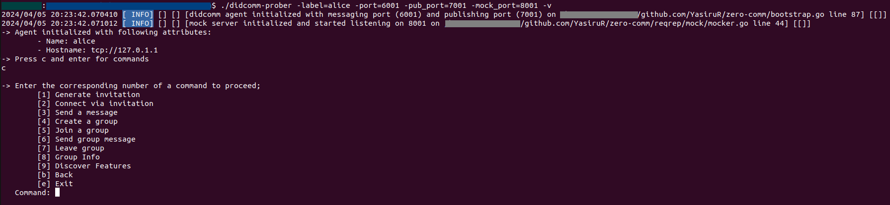
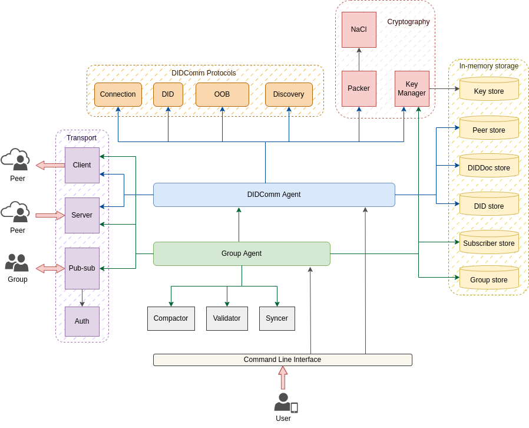
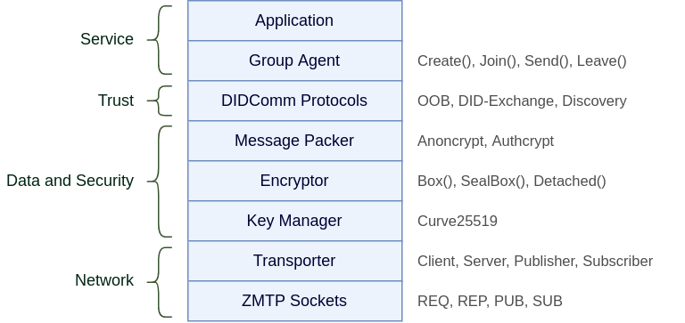

# ZeroComm

ZeroComm is a Go implementation of a novel solution which 
enables decentralized secure messaging with both peer-to-peer
and group communication, while combining DIDComm framework and 
ZeroMQ transport protocol. This prototype was researched and designed as 
a thesis project.

Please refer to the [documentation](docs/zerocomm.pdf) to find more information about the requirements,
architecture, design, implementation and performance evaluation of the solution.

Supported features:
- Generating invitations to connect with agents
- Connecting via invitations
- Peer-to-peer communication
- Creating a group
- Joining a group
- Group messaging
- Leaving a group
- Fetching group information
- Discover services of the agent

## Usage

Follow the steps listed below to start an agent.

1. Clone the repository
2. Build from the source code by running `go build` command in the parent directory
3. Start the agent. eg: `./didcomm-prober -label=alice -port=6001 -pub_port=7001 -mock_port=8001 -mock -v` 
4. Press `c` and enter to proceed

### Parameters

- `label`: display name of the agent
- `port`: port for peer-to-peer communication
- `pub_port`: port for group communication
- `mock_port`: port for testing purposes
- `mock`: if used, enables mocking endpoints
- `v`: if used, prints the logs of the agent

## Internal Architecture

## Component stack

## Dependencies

<table>
<thead>
<tr>
<th>Dependency</th>
<th>Version</th>
<th>Description</th>
</tr>
</thead>

<tbody>
<tr>
<td><a href="https://golang.org/x/crypto">crypto</a></td>
<td>v0.0.0</td>
<td>This repository holds supplementary Go cryptography libraries</td>
</tr>

<tr>
<td><a href="https://golang.org/x/sys">sys</a></td>
<td>v0.0.0</td>
<td>This repository holds supplemental Go packages for low-level interactions with the operating system.</td>
</tr>

<tr>
<td><a href="https://github.com/pebbe/zmq4">zmq4</a></td>
<td>v1.2.9</td>
<td>A Go interface to ZeroMQ version 4</td>
</tr>

<tr>
<td><a href="https://github.com/klauspost/compress">compress</a></td>
<td>v1.15.14</td>
<td>Optimized Go Compression Packages</td>
</tr>

<tr>
<td><a href="https://github.com/logrusorgru/aurora">aurora</a></td>
<td>v0.0.0</td>
<td>Golang ultimate ANSI-colors that supports Printf/Sprintf methods</td>
</tr>

<tr>
<td><a href="https://github.com/gorilla/mux">mux</a></td>
<td>v1.7.3</td>
<td>A powerful HTTP router and URL matcher for building Go web servers with 🦍</td>
</tr>

<tr>
<td><a href="https://github.com/google/gofuzz">gofuzz</a></td>
<td>v1.2.0</td>
<td>Fuzz testing for go.</td>
</tr>

<tr>
<td><a href="https://github.com/google/uuid">uuid</a></td>
<td>v1.1.1</td>
<td>Go package for UUIDs based on RFC 4122 and DCE 1.1: Authentication and Security Services.</td>
</tr>

<tr>
<td><a href="https://github.com/btcsuite/btcutil">btcutil</a></td>
<td>v1.0.3</td>
<td>Provides bitcoin-specific convenience functions and types</td>
</tr>

<tr>
<td><a href="https://github.com/GoKillers/libsodium-go">libsodium-go</a></td>
<td>v0.0.0</td>
<td>A complete overhaul of the Golang wrapper for libsodium</td>
</tr>

<tr>
<td><a href="https://github.com/rs/zerolog">zerolog</a></td>
<td>v1.22.0</td>
<td>Zero Allocation JSON Logger</td>
</tr>

<tr>
<td><a href="https://github.com/tryfix/log">log</a></td>
<td>v1.2.1</td>
<td></td>
</tr>
</tbody>
</table>
